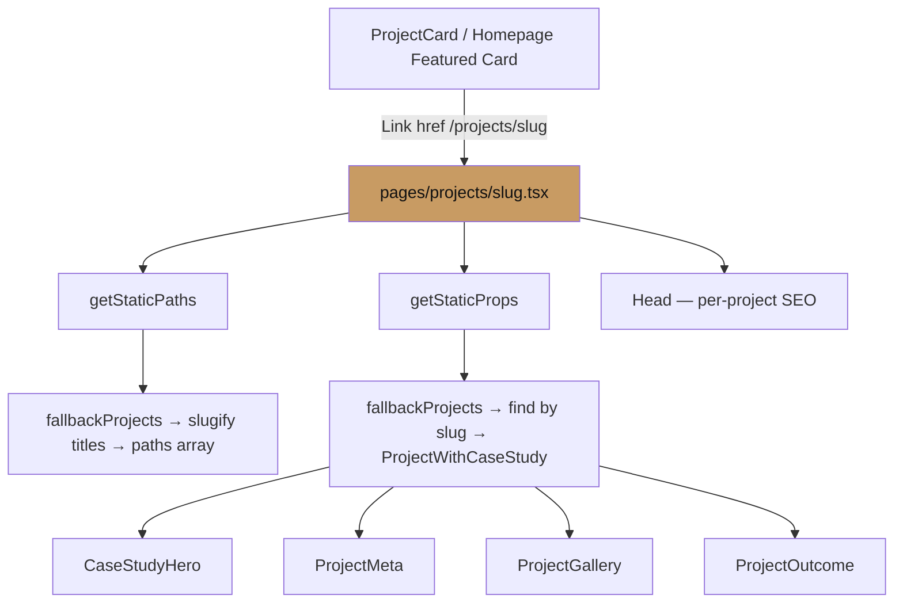
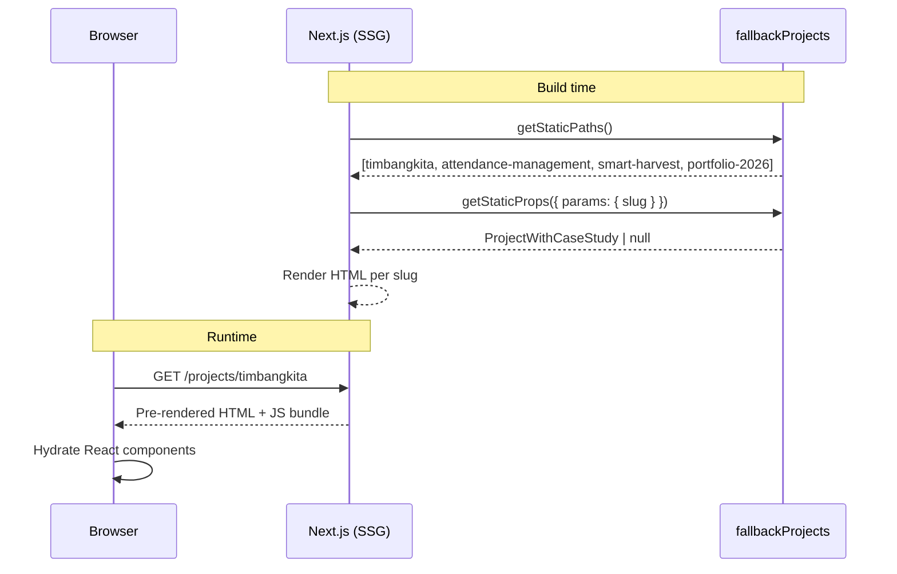
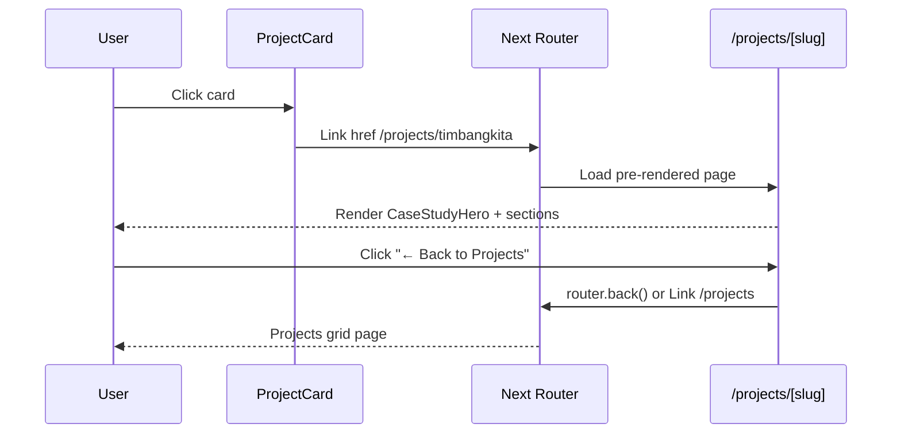

# Design Document: Project Detail Page (Case Study)

## Overview

This feature adds a dedicated, statically-generated case study page for each project in Nicole's portfolio. Visitors who click a project card are routed to `/projects/[slug]`, where they find an in-depth breakdown of the work: problem statement, role, process, visuals, tech stack, and outcome. The page is built with Next.js static generation (`getStaticPaths` + `getStaticProps`), extends the existing `Project` type with optional case-study fields, and follows the portfolio's established CSS-class-only styling convention — no Tailwind utility classes in JSX.

The design integrates seamlessly into the existing Pages Router architecture, reuses the `fallbackProjects` data source, and is forward-compatible with a future database-driven approach via `@vercel/postgres`.

---

## Architecture



```mermaid
graph LR
    subgraph Data Layer
        P1[fallbackProjects: Project array]
        P2[ProjectWithCaseStudy extends Project]
        P1 --> P2
    end
    subgraph Routing
        R1[slugify title]
        R2[/projects/timbangkita]
        R3[/projects/attendance-management]
        R4[/projects/smart-harvest]
        R5[/projects/portfolio-2026]
        R1 --> R2
        R1 --> R3
        R1 --> R4
        R1 --> R5
    end
    subgraph Presentation
        C1[CaseStudyHero]
        C2[ProjectMeta]
        C3[ProjectGallery]
        C4[ProjectOutcome]
    end
```

---

## Sequence Diagrams

### Page Load Flow (Static)



### Navigation Flow



---

## Components and Interfaces

### Component 1: `CaseStudyHero`

**Purpose**: Full-width hero section at the top of the detail page. Shows the project image, title, description, and primary CTAs (live link, GitHub link).

**Location**: `src/components/case-study/CaseStudyHero.tsx`

**Interface**:
```typescript
interface CaseStudyHeroProps {
  title: string;
  description: string;
  imageUrl: string;
  liveLink?: string;
  githubLink?: string;
  techStack: string[];
}
```

**Responsibilities**:
- Render the project cover image using `next/image`
- Display title (Playfair Display), description, and tech stack pills
- Render "View Live" and "View Code" action buttons (reuse `.button`, `.button-primary`, `.button-secondary` classes)
- Apply the `.case-study-hero` CSS class family for layout

---

### Component 2: `ProjectMeta`

**Purpose**: A structured metadata panel — role, timeline/duration, challenge summary — displayed as a glassy card strip below the hero.

**Location**: `src/components/case-study/ProjectMeta.tsx`

**Interface**:
```typescript
interface ProjectMetaProps {
  role?: string;
  challenge?: string;
  duration?: string;
}
```

**Responsibilities**:
- Render three labeled columns: Role, Challenge, Duration
- Hide gracefully when all props are undefined (return `null`)
- Use `.case-study-meta` CSS class family

---

### Component 3: `ProjectGallery`

**Purpose**: An optional scrollable image/SVG gallery for process screenshots or UI previews.

**Location**: `src/components/case-study/ProjectGallery.tsx`

**Interface**:
```typescript
interface ProjectGalleryProps {
  gallery?: string[];   // array of image/SVG URLs
  title: string;        // for alt text generation
}
```

**Responsibilities**:
- Render nothing if `gallery` is undefined or empty
- Display images in a responsive grid using `.case-study-gallery` CSS class
- Each image uses `next/image` with generated alt text (`${title} screenshot ${index + 1}`)

---

### Component 4: `ProjectOutcome`

**Purpose**: Narrative section showing the solution, outcome, and highlights (key takeaways or metrics).

**Location**: `src/components/case-study/ProjectOutcome.tsx`

**Interface**:
```typescript
interface ProjectOutcomeProps {
  solution?: string;
  outcome?: string;
  highlights?: string[];
}
```

**Responsibilities**:
- Render only the sub-sections that have content
- Display highlights as a styled list using `.case-study-highlight-list`
- Use `.case-study-outcome` CSS class family

---

## Data Models

### Extended `Project` Type: `ProjectWithCaseStudy`

Added to `src/types.ts` as a type extension of the existing `Project`:

```typescript
// Existing type (unchanged)
export type Project = {
  id: number;
  title: string;
  description: string;
  techStack: string[];
  imageUrl: string;
  githubLink?: string;
  liveLink?: string;
};

// New extended type for case study pages
export type ProjectWithCaseStudy = Project & {
  slug: string;           // derived at runtime via slugify(title)
  role?: string;          // e.g. "Frontend Developer & UI/UX Designer"
  duration?: string;      // e.g. "Jan 2024 – Mar 2024"
  challenge?: string;     // short problem statement (1-2 sentences)
  solution?: string;      // approach taken (paragraph)
  outcome?: string;       // result / impact (paragraph)
  highlights?: string[];  // bullet points: key metrics or takeaways
  gallery?: string[];     // additional image URLs beyond imageUrl
};
```

**Validation Rules**:
- `slug` must be non-empty and URL-safe (lowercase, hyphens only, no special chars)
- `title` must be non-empty (inherited from `Project`)
- `highlights`, if present, must have at least one non-empty string
- `gallery`, if present, must have at least one non-empty URL string

---

### `fallbackProjects` Extension

The four existing projects in `src/data/projects.ts` will be augmented with optional case study fields. The existing `Project[]` array becomes `ProjectWithCaseStudy[]` (backwards-compatible because all new fields are optional). Example:

```typescript
import type { ProjectWithCaseStudy } from "@/types";

export const fallbackProjects: ProjectWithCaseStudy[] = [
  {
    id: 1,
    title: "Timbangkita",
    description: "A comprehensive health tracking platform...",
    techStack: ["Next.js", "PostgreSQL", "Health API"],
    imageUrl: "/project-timbangkita.svg",
    githubLink: "https://github.com/",
    liveLink: "https://vercel.com/",
    // Case study fields
    role: "Full-Stack Developer",
    duration: "Sep 2023 – Dec 2023",
    challenge: "Users lacked a unified tool to track weight goals alongside nutrition data.",
    solution: "Built an interactive dashboard integrating a third-party Health API with a PostgreSQL backend, delivering real-time analytics and goal-progress visualisations.",
    outcome: "Delivered a fully functional MVP with four core modules, achieving sub-200ms average page load times.",
    highlights: [
      "Integrated Health API with 99.8% uptime over the project period",
      "Sub-200ms average page loads via SSR + edge caching",
      "Responsive across mobile, tablet, and desktop"
    ]
  },
  // ... remaining projects follow same pattern
];
```

---

## Algorithmic Pseudocode

### Slug Generation Algorithm

```pascal
ALGORITHM slugify(title)
INPUT:  title — string (project title)
OUTPUT: slug  — string (URL-safe lowercase slug)

PRECONDITION:  title ≠ "" AND title ≠ null
POSTCONDITION: slug contains only [a-z0-9-], no leading/trailing hyphens,
               no consecutive hyphens

BEGIN
  normalised ← LOWERCASE(title)
  normalised ← REPLACE_ALL(normalised, /[^a-z0-9\s-]/, "")
  normalised ← TRIM(normalised)
  slug       ← REPLACE_ALL(normalised, /\s+/, "-")
  slug       ← REPLACE_ALL(slug,       /-{2,}/, "-")
  slug       ← TRIM_CHARS(slug, "-")
  
  ASSERT slug ≠ ""
  RETURN slug
END
```

**Preconditions**:
- `title` is a non-empty, non-null string

**Postconditions**:
- Result contains only `[a-z0-9-]` characters
- No leading or trailing hyphens
- No consecutive hyphens
- Result is non-empty when input is non-empty

**Loop Invariants**: N/A (no loops — pure string transformations)

---

### `getStaticPaths` Algorithm

```pascal
ALGORITHM getStaticPaths()
INPUT:  fallbackProjects — ProjectWithCaseStudy[]
OUTPUT: { paths: [{params: {slug: string}}], fallback: false }

PRECONDITION:  fallbackProjects.length > 0
               FOR ALL p IN fallbackProjects: p.title ≠ ""

POSTCONDITION: paths.length = fallbackProjects.length
               FOR ALL path IN paths: path.params.slug = slugify(corresponding project title)

BEGIN
  paths ← EMPTY_ARRAY
  
  FOR EACH project IN fallbackProjects DO
    ASSERT project.title ≠ ""
    slug  ← slugify(project.title)
    paths ← APPEND(paths, { params: { slug } })
  END FOR
  
  ASSERT paths.length = fallbackProjects.length
  RETURN { paths, fallback: false }
END
```

**Loop Invariants**:
- `paths.length` equals the number of projects processed so far
- Every entry in `paths` has a non-empty `params.slug`

---

### `getStaticProps` Algorithm

```pascal
ALGORITHM getStaticProps({ params })
INPUT:  params.slug — string
        fallbackProjects — ProjectWithCaseStudy[]
OUTPUT: { props: { project: ProjectWithCaseStudy } }
     OR { notFound: true }

PRECONDITION:  params.slug ≠ "" AND params.slug ≠ null

POSTCONDITION: IF a project P exists WHERE slugify(P.title) = params.slug
                 THEN props.project = P
               ELSE notFound = true

BEGIN
  project ← FIND project IN fallbackProjects
               WHERE slugify(project.title) = params.slug
  
  IF project = null OR project = undefined THEN
    RETURN { notFound: true }
  END IF
  
  ASSERT slugify(project.title) = params.slug
  RETURN { props: { project } }
END
```

**Preconditions**:
- `params.slug` is a non-empty string
- `fallbackProjects` is non-empty

**Postconditions**:
- If a matching project exists, `props.project` is that project
- If no match is found, `notFound: true` triggers Next.js 404 page

---

### Detail Page Render Algorithm

```pascal
ALGORITHM ProjectDetailPage(props)
INPUT:  props.project — ProjectWithCaseStudy
OUTPUT: React element tree (HTML)

PRECONDITION:  props.project ≠ null
               props.project.title ≠ ""
               props.project.imageUrl ≠ ""

BEGIN
  RENDER Head WITH:
    title  ← project.title + " | Nicole.dev"
    description ← project.description
    og:image    ← project.imageUrl
    og:title    ← project.title
  END Head

  RENDER section.case-study-page WITH:
    CaseStudyHero(
      title=project.title,
      description=project.description,
      imageUrl=project.imageUrl,
      liveLink=project.liveLink,
      githubLink=project.githubLink,
      techStack=project.techStack
    )
    
    IF project.role OR project.challenge OR project.duration THEN
      ProjectMeta(
        role=project.role,
        challenge=project.challenge,
        duration=project.duration
      )
    END IF
    
    IF project.solution OR project.outcome OR project.highlights THEN
      ProjectOutcome(
        solution=project.solution,
        outcome=project.outcome,
        highlights=project.highlights
      )
    END IF
    
    IF project.gallery AND project.gallery.length > 0 THEN
      ProjectGallery(gallery=project.gallery, title=project.title)
    END IF
    
    Link href="/projects" className="case-study-back-link"
      ← "← Back to Projects"
  END section
END
```

---

## Key Functions with Formal Specifications

### `slugify(title: string): string`

**Location**: `src/utils/slugify.ts`

```typescript
export function slugify(title: string): string
```

**Preconditions**:
- `title` is a non-null, non-undefined string
- `title.trim().length > 0`

**Postconditions**:
- Return value matches `/^[a-z0-9]+(-[a-z0-9]+)*$/`
- `slugify(slugify(title)) === slugify(title)` (idempotent)
- Two distinct titles that differ only by casing or spacing produce different slugs only when their normalised forms differ

**Loop Invariants**: N/A

---

### `getStaticPaths(): GetStaticPathsResult`

**Location**: `src/pages/projects/[slug].tsx`

**Preconditions**:
- `fallbackProjects` is a non-empty array
- Every project in `fallbackProjects` has a non-empty `title`

**Postconditions**:
- Returned `paths` array has exactly `fallbackProjects.length` entries
- Each entry `paths[i].params.slug === slugify(fallbackProjects[i].title)`
- `fallback` is `false` (unknown slugs serve 404)

---

### `getStaticProps({ params }): GetStaticPropsResult`

**Location**: `src/pages/projects/[slug].tsx`

**Preconditions**:
- `params.slug` is a non-empty string previously produced by `getStaticPaths`

**Postconditions**:
- If `∃ p ∈ fallbackProjects` where `slugify(p.title) === params.slug`:
  returns `{ props: { project: p } }`
- Otherwise: returns `{ notFound: true }`

---

## Example Usage

### Route and Navigation

```typescript
// src/utils/slugify.ts
export function slugify(title: string): string {
  return title
    .toLowerCase()
    .replace(/[^a-z0-9\s-]/g, "")
    .trim()
    .replace(/\s+/g, "-")
    .replace(/-{2,}/g, "-")
    .replace(/^-+|-+$/g, "");
}

// Usage in ProjectCard.tsx — wrap article in a Link
import Link from "next/link";
import { slugify } from "@/utils/slugify";

// Before: <article className="project-card">
// After:
<Link href={`/projects/${slugify(project.title)}`}>
  <article className="project-card project-card--linked">
    {/* existing card content */}
  </article>
</Link>
```

### `getStaticPaths` and `getStaticProps`

```typescript
// src/pages/projects/[slug].tsx
import type { GetStaticPaths, GetStaticProps } from "next";
import { fallbackProjects } from "@/data/projects";
import { slugify } from "@/utils/slugify";
import type { ProjectWithCaseStudy } from "@/types";

export const getStaticPaths: GetStaticPaths = async () => {
  const paths = fallbackProjects.map((project) => ({
    params: { slug: slugify(project.title) },
  }));
  return { paths, fallback: false };
};

export const getStaticProps: GetStaticProps<{ project: ProjectWithCaseStudy }> = async ({ params }) => {
  const slug = params?.slug as string;
  const project = fallbackProjects.find((p) => slugify(p.title) === slug);
  if (!project) return { notFound: true };
  return { props: { project } };
};
```

### Detail Page Component

```typescript
// src/pages/projects/[slug].tsx (component portion)
import Head from "next/head";
import Link from "next/link";
import CaseStudyHero from "@/components/case-study/CaseStudyHero";
import ProjectMeta from "@/components/case-study/ProjectMeta";
import ProjectGallery from "@/components/case-study/ProjectGallery";
import ProjectOutcome from "@/components/case-study/ProjectOutcome";

export default function ProjectDetailPage({ project }: { project: ProjectWithCaseStudy }) {
  return (
    <>
      <Head>
        <title>{project.title} | Nicole.dev</title>
        <meta name="description" content={project.description} />
        <meta property="og:title" content={project.title} />
        <meta property="og:description" content={project.description} />
        <meta property="og:image" content={project.imageUrl} />
      </Head>

      <section className="case-study-page">
        <CaseStudyHero
          title={project.title}
          description={project.description}
          imageUrl={project.imageUrl}
          liveLink={project.liveLink}
          githubLink={project.githubLink}
          techStack={project.techStack}
        />

        {(project.role || project.challenge || project.duration) && (
          <ProjectMeta
            role={project.role}
            challenge={project.challenge}
            duration={project.duration}
          />
        )}

        {(project.solution || project.outcome || project.highlights) && (
          <ProjectOutcome
            solution={project.solution}
            outcome={project.outcome}
            highlights={project.highlights}
          />
        )}

        {project.gallery && project.gallery.length > 0 && (
          <ProjectGallery gallery={project.gallery} title={project.title} />
        )}

        <Link href="/projects" className="case-study-back-link">
          ← Back to Projects
        </Link>
      </section>
    </>
  );
}
```

---

## Correctness Properties

These properties must hold at all times. They are suitable targets for property-based testing (fast-check or similar).

**Property 1 — Slug Uniqueness**
For all pairs of projects `(a, b)` in `fallbackProjects` where `a.id ≠ b.id`:
`slugify(a.title) ≠ slugify(b.title)`

> Ensures every project gets a distinct URL.

**Property 2 — Slug Round-Trip**
For all project titles `t`:
`slugify(slugify(t)) === slugify(t)`

> Ensures the slug function is idempotent — applying it twice produces the same result as once.

**Property 3 — Slug Character Set**
For all non-empty titles `t`:
`slugify(t)` matches `/^[a-z0-9]+(-[a-z0-9]+)*$/`

> Ensures slugs are always URL-safe and non-empty.

**Property 4 — Static Path Coverage**
The set of slugs returned by `getStaticPaths` equals the set `{ slugify(p.title) | p ∈ fallbackProjects }`.

> Ensures every project has a routable page.

**Property 5 — `getStaticProps` Consistency**
For every slug `s` in the paths returned by `getStaticPaths`:
`getStaticProps({ params: { slug: s } })` returns `{ props: { project: P } }` where `slugify(P.title) === s`.

> Ensures every generated path resolves to the correct project.

**Property 6 — `notFound` for Unknown Slugs**
For any string `s` not in the set of known slugs:
`getStaticProps({ params: { slug: s } })` returns `{ notFound: true }`.

> Ensures unknown paths produce a 404, not a runtime error.

**Property 7 — Optional Fields Render Safely**
For any `ProjectWithCaseStudy` where all optional case-study fields are `undefined`:
The detail page renders without errors and displays at least the title, description, image, and tech stack.

> Ensures the page degrades gracefully when no case-study data is authored.

---

## Error Handling

### Scenario 1: Unknown Slug

**Condition**: A visitor navigates to `/projects/some-unknown-slug`.
**Response**: `getStaticProps` returns `{ notFound: true }`; Next.js serves the built-in 404 page.
**Recovery**: User can navigate back via the Navbar or browser back button.

### Scenario 2: Missing Optional Case Study Fields

**Condition**: A project in `fallbackProjects` has no `role`, `challenge`, `solution`, `outcome`, `highlights`, or `gallery` fields.
**Response**: `ProjectMeta`, `ProjectOutcome`, and `ProjectGallery` components all render `null` safely; only `CaseStudyHero` is shown.
**Recovery**: No user-visible error; page renders a minimal but complete view.

### Scenario 3: Image Load Failure

**Condition**: `project.imageUrl` points to an asset that cannot be loaded (broken SVG path, removed file).
**Response**: `next/image` renders the image element; alt text is shown by the browser.
**Recovery**: Use a placeholder SVG (`/project-placeholder.svg`) as a fallback strategy in the `<Image>` component via the `onError` handler if needed.

### Scenario 4: Empty `gallery` Array

**Condition**: `project.gallery` exists but is an empty array (`[]`).
**Response**: The `ProjectGallery` component receives an empty array and returns `null` — no empty container is rendered.
**Recovery**: No action needed; the page renders without the gallery section.

---

## CSS Classes to Add to `portfolio.css`

All new classes follow the existing naming conventions: kebab-case, component-scoped prefixes, no Tailwind utilities in JSX.

```css
/* ─────────────────────────────────────────
   Case Study Page — outer wrapper
───────────────────────────────────────── */
.case-study-page {
  width: min(1280px, calc(100% - 3rem));
  margin: 0 auto;
  padding: 4rem 0 6rem;
}

/* ─────────────────────────────────────────
   CaseStudyHero
───────────────────────────────────────── */
.case-study-hero {
  display: grid;
  grid-template-columns: 1fr 1fr;
  gap: 3.5rem;
  align-items: center;
  margin-bottom: 4rem;
}

.case-study-hero-media {
  border-radius: 36px;
  overflow: hidden;
  background: linear-gradient(180deg, rgba(200, 155, 99, 0.12), rgba(255, 255, 255, 0.18));
  border: 1px solid var(--border);
  box-shadow: 0 42px 110px rgba(24, 24, 24, 0.12);
}

.case-study-hero-image {
  width: 100%;
  height: auto;
  display: block;
}

.case-study-hero-copy {
  display: grid;
  gap: 1.5rem;
}

.case-study-hero-copy h1 {
  font-size: clamp(2.8rem, 4vw, 4rem);
  line-height: 0.96;
  letter-spacing: -0.04em;
}

.case-study-hero-copy p {
  color: var(--muted);
  font-size: 1.05rem;
  max-width: 48ch;
}

.case-study-hero-actions {
  display: flex;
  flex-wrap: wrap;
  gap: 1rem;
}

/* ─────────────────────────────────────────
   ProjectMeta — metadata strip
───────────────────────────────────────── */
.case-study-meta {
  display: grid;
  grid-template-columns: repeat(3, minmax(0, 1fr));
  gap: 1.25rem;
  margin-bottom: 3.5rem;
}

.case-study-meta-item {
  padding: 1.75rem;
  border-radius: 28px;
  background: var(--surface);
  border: 1px solid var(--border);
  box-shadow: 0 28px 74px rgba(24, 24, 24, 0.08);
}

.case-study-meta-label {
  display: block;
  color: var(--accent);
  font-size: 0.8rem;
  font-weight: 700;
  letter-spacing: 0.22em;
  text-transform: uppercase;
  margin-bottom: 0.6rem;
}

.case-study-meta-value {
  color: var(--text);
  font-size: 1rem;
  font-weight: 600;
}

/* ─────────────────────────────────────────
   ProjectOutcome — solution / outcome / highlights
───────────────────────────────────────── */
.case-study-outcome {
  display: grid;
  grid-template-columns: 1fr 1fr;
  gap: 3rem;
  margin-bottom: 3.5rem;
  padding: 2.5rem;
  border-radius: 36px;
  background: var(--surface);
  border: 1px solid var(--border);
  box-shadow: 0 40px 110px rgba(24, 24, 24, 0.12);
}

.case-study-outcome-heading {
  display: block;
  color: var(--accent);
  font-size: 0.8rem;
  font-weight: 700;
  letter-spacing: 0.22em;
  text-transform: uppercase;
  margin-bottom: 1rem;
}

.case-study-outcome-text {
  color: var(--muted);
  line-height: 1.85;
}

.case-study-highlight-list {
  display: grid;
  gap: 0.75rem;
  list-style: none;
  padding: 0;
  margin: 0;
}

.case-study-highlight-list li {
  display: flex;
  align-items: flex-start;
  gap: 0.75rem;
  color: var(--text);
  font-size: 0.98rem;
}

.case-study-highlight-list li::before {
  content: "✦";
  color: var(--accent);
  font-size: 0.75rem;
  margin-top: 0.35rem;
  flex-shrink: 0;
}

/* ─────────────────────────────────────────
   ProjectGallery
───────────────────────────────────────── */
.case-study-gallery {
  margin-bottom: 3.5rem;
}

.case-study-gallery-heading {
  color: var(--muted);
  font-size: 0.8rem;
  font-weight: 700;
  letter-spacing: 0.22em;
  text-transform: uppercase;
  margin-bottom: 1.5rem;
}

.case-study-gallery-grid {
  display: grid;
  grid-template-columns: repeat(auto-fill, minmax(280px, 1fr));
  gap: 1.25rem;
}

.case-study-gallery-item {
  border-radius: 24px;
  overflow: hidden;
  border: 1px solid var(--border);
  background: var(--surface);
  box-shadow: 0 28px 74px rgba(24, 24, 24, 0.08);
}

.case-study-gallery-image {
  width: 100%;
  height: auto;
  display: block;
}

/* ─────────────────────────────────────────
   Back navigation link
───────────────────────────────────────── */
.case-study-back-link {
  display: inline-flex;
  align-items: center;
  gap: 0.5rem;
  color: var(--accent);
  font-weight: 700;
  font-size: 0.95rem;
  transition: gap 200ms ease, opacity 200ms ease;
}

.case-study-back-link:hover {
  gap: 0.75rem;
  opacity: 0.8;
}

/* ─────────────────────────────────────────
   ProjectCard — linked variant
   (wrapping article in <Link> adds pointer cursor)
───────────────────────────────────────── */
.project-card--linked {
  cursor: pointer;
  transition: transform 220ms ease, box-shadow 220ms ease, border-color 220ms ease;
}

.project-card--linked:hover {
  transform: translateY(-5px);
  box-shadow: 0 48px 120px rgba(24, 24, 24, 0.16);
  border-color: rgba(200, 155, 99, 0.28);
}

/* ─────────────────────────────────────────
   Responsive overrides
───────────────────────────────────────── */
@media (max-width: 1060px) {
  .case-study-hero {
    grid-template-columns: 1fr;
  }

  .case-study-outcome {
    grid-template-columns: 1fr;
    gap: 2rem;
  }
}

@media (max-width: 820px) {
  .case-study-meta {
    grid-template-columns: 1fr;
  }

  .case-study-page {
    padding: 2.5rem 0 4rem;
  }
}
```

---

## Testing Strategy

### Unit Testing Approach

Test pure utility functions and component rendering in isolation.

**Key unit tests**:
- `slugify("")` → throws or returns empty string (edge case)
- `slugify("Timbangkita")` → `"timbangkita"`
- `slugify("Attendance Management")` → `"attendance-management"`
- `slugify("Portfolio 2026")` → `"portfolio-2026"`
- `slugify("Smart Harvest")` → `"smart-harvest"`
- `ProjectDetailPage` renders with minimal props (all optional fields absent)
- `ProjectMeta` returns `null` when all props are undefined
- `ProjectGallery` returns `null` when `gallery` is empty

### Property-Based Testing Approach

**Property Test Library**: fast-check

Target properties (matching the Correctness Properties section):

```typescript
// Property 1: Slug uniqueness across all fallbackProjects
fc.assert(
  fc.property(fc.uniqueArray(fc.string()), (titles) => {
    const slugs = titles.map(slugify);
    return new Set(slugs).size === slugs.length || slugs.some(s => s === "");
  })
);

// Property 2: Idempotence
fc.assert(
  fc.property(fc.string({ minLength: 1 }), (title) => {
    return slugify(slugify(title)) === slugify(title);
  })
);

// Property 3: Valid character set
fc.assert(
  fc.property(fc.string({ minLength: 1 }), (title) => {
    const slug = slugify(title);
    return slug === "" || /^[a-z0-9]+(-[a-z0-9]+)*$/.test(slug);
  })
);

// Property 5: getStaticProps consistency
fc.assert(
  fc.property(fc.constantFrom(...fallbackProjects), (project) => {
    const slug = slugify(project.title);
    const result = getStaticPropsSync({ params: { slug } });
    return "props" in result && result.props.project.id === project.id;
  })
);
```

### Integration Testing Approach

- Render `src/pages/projects/[slug].tsx` with each of the four known slugs using Next.js test utilities; assert `<title>` tag and hero heading are correct.
- Assert that navigating to an unknown slug results in a 404 response (via `notFound: true`).
- Assert that all four paths from `getStaticPaths` resolve without error in `getStaticProps`.

---

## Performance Considerations

- **Static generation**: All pages are pre-rendered at build time — zero server compute on navigation.
- **`next/image`**: Automatic WebP conversion and lazy loading for all project images and gallery items.
- **`fallback: false`**: Unknown slugs immediately return 404, no ISR overhead.
- **No additional API calls**: The detail page is fully self-contained from `fallbackProjects`; no network requests at runtime.
- **CSS-only transitions**: All hover and theme transitions use CSS (`transition` property) rather than JS animation libraries — no runtime overhead.

---

## Security Considerations

- **No user-supplied data in URLs**: Slugs are derived from controlled `fallbackProjects` data, not from raw query params, eliminating injection risk.
- **No dynamic DB queries at runtime**: The detail page uses static props; no SQL is executed on page load.
- **`rel="noreferrer"` on external links**: All `githubLink` and `liveLink` anchors use `target="_blank" rel="noreferrer"` to prevent tab-napping.
- **`next/image` domain restriction**: If gallery images are ever sourced from external CDNs, the domain must be added to `next.config.mjs` `images.remotePatterns`.

---

## Dependencies

No new npm dependencies are required. The feature uses only:

| Dependency | Already installed | Usage |
|---|---|---|
| `next` (Pages Router) | ✅ | `getStaticPaths`, `getStaticProps`, `<Head>`, `<Link>`, `<Image>` |
| `react` | ✅ | Component authoring |
| `typescript` | ✅ | Type safety for `ProjectWithCaseStudy` |
| `@vercel/postgres` | ✅ | Not used in this phase; forward-compatible |
| `fast-check` | ⚠️ dev-only, add if not present | Property-based testing |

To add fast-check if missing:
```
npm install --save-dev fast-check
```
